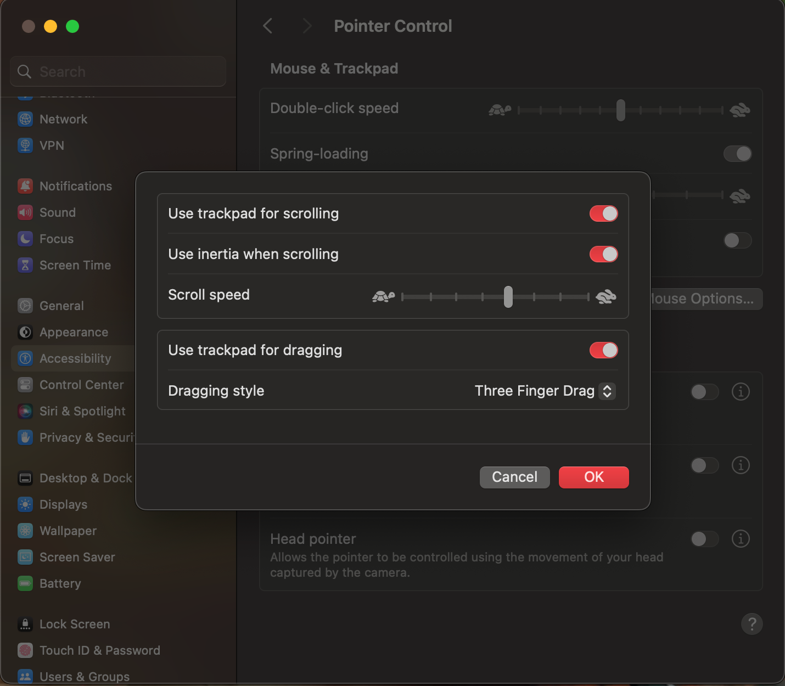

# Macbook Setup Guide For Web Programmer

Setting up a new Macbook will be tough and cumbersome. Every time I am getting a new Macbook, I go over the same steps on how to set it up for my working experience.

I create a record of my setup, hoping it's helpful for others too!

## Immediate Frist Steps

### Enable Tap to Click

When setting up a new Macbook, one of the first changes we make is enabling the tap-to-click feature for the trackpad.

Go「**System Preference -> Trackpad -> Point & Click**」and enable 「**Tap to click**」 option.


### Enable Three Finger Dragging

In general, "tap to click" on your Macbook to avoid a force-click on the trackpad. But this doesn't work when it comes to dragging and repositioning windows.

Also, I'm big fan of tree finger dragging.

1. Go 「**System Preference -> Accessibility**」.
2. In the Accessibility sidebar, choose option 「**Pointer Control**」.
3. Click the button 「**Trackpad Options**」.
4. Enable dragging and select 「**three finger drag**」.



### Change Wallpaper

Visit [wallhaven](https://wallhaven.cc/) to find a wonderful wallpaper and replace the default ones.

### Download Edge

After discovering [chrome are eating my old Mac's battery](https://twitter.com/xiaokedada/status/1495037432273596419), I turned to use [edge](https://www.microsoft.com/zh-cn/edge).


## Install Homebrew

[Homebrew](https://brew.sh/) is "The Missing Package Manager for macOS".

Simply follow their installation guide, copy `/bin/bash -c "$(curl -fsSL https://raw.githubusercontent.com/Homebrew/install/HEAD/install.sh)"` to terminal.

> For [GFW](https://en.wikipedia.org/wiki/Great_Firewall) reasons, the Chinese users will fail to connect to github.

> Just copy `/bin/zsh -c "$(curl -fsSL https://gitee.com/cunkai/HomebrewCN/raw/master/Homebrew.sh)"` to your terminal. It will do the same thing when installing homebrew.

## Setup Terminal

Use [iTerm2](https://iterm2.com/) as macOS terminal replacement.

1. **Use the Homebrew to install iTerm2**

```shell
$ brew install --cask iterm2
```

2. **Change a few settings of iterm2**

+ Go 「**iterm2 Preferences -> Profiles -> Default -> Window**」, add transparency and blur.


+ Go 「**iterm2 Preferences -> Profiles -> Default -> Keys -> Key Mappings**」, replace the standard ones with the preset "Natural Text Editing".


